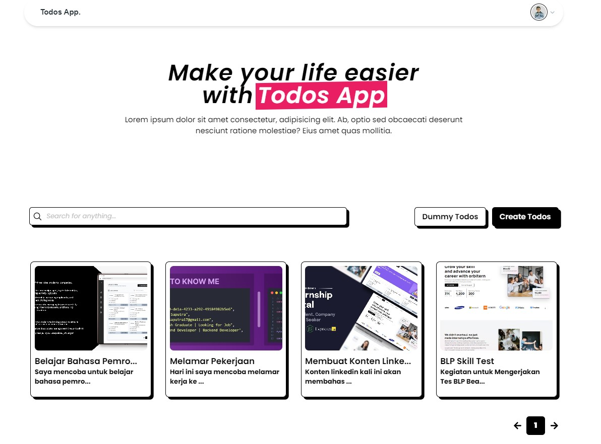

# TODO LIST APPLICATION



Aplikasi Todo List ini adalah sebuah website yang dirancang untuk membantu mengelola dan mengatur kegiatan harian kita dengan lebih efisien. Website ini dikembangkan sebagai bagian dari **Skill Test** BLP Beauty, dalam rangka proses rekrutmen untuk posisi IT Developer. Dibangun menggunakan teknologi JavaScript, Node.js, Express.js, MySQL, dan React.js, aplikasi ini menghadirkan solusi praktis dalam memanajemen tugas, dengan antarmuka yang mudah digunakan serta performa yang optimal.

## Demo Website

Klik link berikut ini untuk melihat demo 👉 [Link Youtube](https://youtube.com)

## Table of Contents

- [Cara Penggunaan](#cara-penggunaan)
  - [Preperation](#preperation)
  - [Getting Started](#getting-started)
    - [Backend Setup](#backend-setup)
    - [Frontend Setup](#frontend-setup)
- [Dependencies](#dependencies)
  - [Frontend](#frontend)
  - [Backend](#backend)
- [Backend Documentation](#backend-documentation)
- [Contact Support](#contact-support)

## Cara Penggunaan

Berikut ini merupakan cara installasi dan penggunaan website todo list app.

### Preparation

Sebelum memulai, pastikan Anda telah menginstal hal berikut:

- [Node.js](https://nodejs.org/) (versi terbaru)
- [npm](https://www.npmjs.com/) (biasanya terinstal bersamaan dengan Node.js)
- [Laragon](https://laragon.org/download/)(bisa juga menggunakan XAMPP atau tools lainnya sesuai dengan kebutuhan anda)

### Getting Started

Ikuti langkah-langkah di bawah ini untuk mengatur aplikasi Todo List di lingkungan lokal Anda:

### 1. Clone Repository

Clone repository ini ke mesin lokal Anda menggunakan perintah:

```bash
git clone https://github.com/nunusaputra/blp_itdev_wisnu.git
```

---

### 2. Open Folder

Buka folder hasil clone repository tadi menggunakan terminal (saya biasanya menggunakan git bash)

---

### 3. Move Backend Directory

Selanjutnya kita akan mengatur backend setup seperti di bawah ini.

#### Backend Setup

**1. Masuk Kedalam Backend Directory**

```bash
cd backend/
```

**2. Install Dependencies Pada Backend Directory**

```bash
npm install
```

**3. Setup Environment Variabel**
Buat file .env pada root directory, lalu sesuaikan dengan contoh di bawah ini.

```js
PORT = YOUR_PORT;
ACCESS_TOKEN_SECRET = YOUR_ACCESS_TOKEN_SECRET;
REFRESH_TOKEN_SECRET = YOUR_REFRESH_TOKEN_SECRET;
```

**4. Setup Database** <br>
Buka folder `config`, dan masuk ke file `config.json`. Kemudian sesuaikan settingan database anda pada bagian development.

```json
{
  "development": {
    "username": "YOUR_USERNAME",
    "password": "YOUR_PASSWORD",
    "database": "YOUR_DB_NANE",
    "host": "127.0.0.1",
    "dialect": "mysql"
  },
  "test": {
    "username": "root",
    "password": null,
    "database": "database_test",
    "host": "127.0.0.1",
    "dialect": "mysql"
  },
  "production": {
    "username": "root",
    "password": null,
    "database": "database_production",
    "host": "127.0.0.1",
    "dialect": "mysql"
  }
}
```

**5. Create Database** <br>
Setelah anda menyesuaikan settingan database pada file `config.json`, langkah selanjutnya adalah create database tersebut dengan perintah `npx sequelize-cli db:create`. Namun pastikan anda mengaktifkan web server lokal `(laragon / xampp)` anda terlebih dahulu agar tidak terjadi error.

```bash
npx sequelize-cli db:create
```

**6. Migration Database** <br>
Selanjutnya kita perlu melakukan migration terlebih dahulu dengan perintah berikut ini:

```bash
npx sequelize-cli db:migrate
```

**7. Jalankan Aplikasi Backend** <br>
Setelah semua proses selesai, anda bisa menjalankan aplikasi backend ini dengan perintah berikut:

```bash
npm run dev
```

---

### 4. Move Frontend Directory

Selanjutnya kita akan mengatur frontend setup seperti di bawah ini

#### Frontend Setup

**1. Masuk Kedalam Frontend Directory**

```bash
cd frontend/
```

**2. Install Dependencies Pada Frontend Directory**

```bash
npm install
```

**3. Setup Environment Variabel**
Buat file .env pada root directory, lalu sesuaikan dengan contoh di bawah ini.

```js
# API URL AUTH
VITE_API_URL_AUTH = "http://localhost:{YOUR_PORT}/auth"

# API URL TODOS
VITE_API_URL_TODOS = "http://localhost:{YOUR_PORT}/todos"
```

**4. Build Frontend Directory**

```bash
npm run build
```

**5. Jalankan Aplikasi Frontend**

```bash
npm run dev
```

---

## Dependencies

- Frontend:

  - @heroicons/react
  - @material-tailwind/react
  - @reduxjs/toolkit"
  - axios
  - heroicons
  - jwt-decode
  - react
  - react-dom
  - react-icons
  - react-quill
  - react-redux
  - react-router-dom
  - react-spinners
  - react-toastify
  - tailwindcss

- Backend:
  - argon2
  - axios
  - cookie-parser
  - cors
  - dotenv
  - express
  - express-fileupload
  - express-validator
  - jsonwebtoken
  - mysql2
  - sequelize
  - nodemon
  - sequelize-cli

---

## Backend Documentation

Anda dapat melihat dokumentasi backend pada link berikut 👉 [Backend Documentation](https://github.com/nunusaputra/blp_itdev_wisnu/blob/main/backend/Documentation.md)

---

## Contact Support

Apabila terjadi kendala dalam menjalankan aplikasi todo list ini, jangan ragu untuk bertanya melalui email / whatsapp berikut ini: [email](https://mail.google.com/mail/?view=cm&fs=1&tf=1&to=nunusaputra17@gmail.com&su=Kendala%20Dalam%20Menjalankan%20Aplikasi%20Todo%20List&body=Bisakah%20kamu%20membantu%20saya?) | [whatsapp](https://wa.me/6283815499134)
